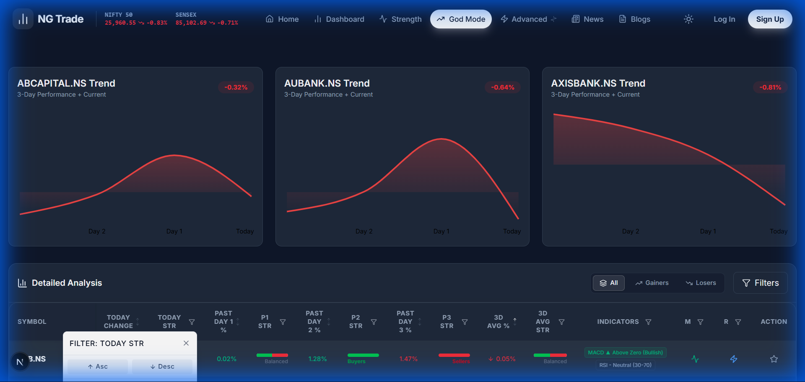
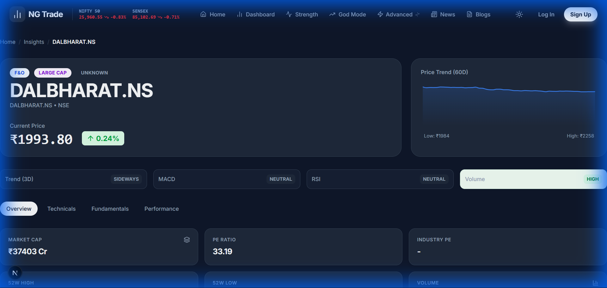
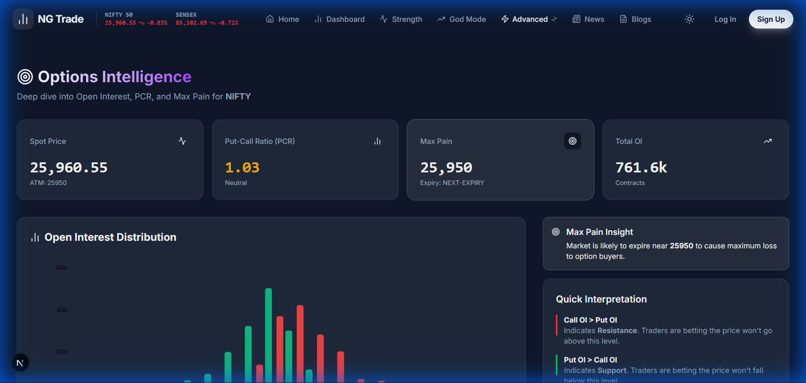
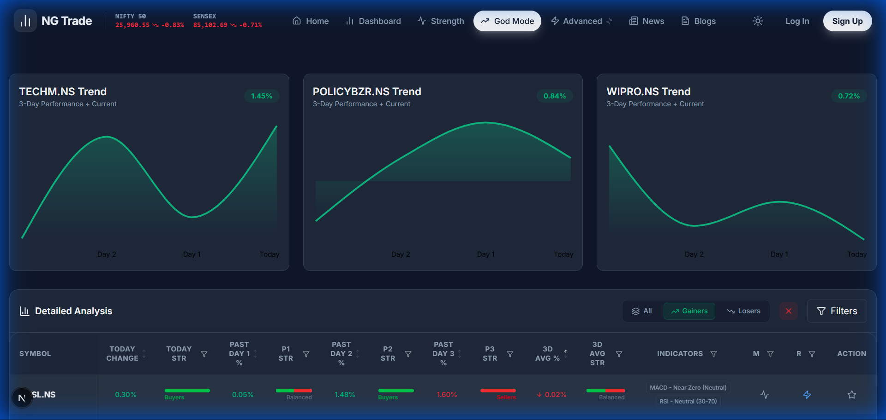

# PROJECT TITLE
# **“NSE F&O Stock Analyzer – A Real-Time Market Analytics System”**

 
 
 

**Submitted By:**  
**Name:** [Your Name]  
**Roll No:** [Your Roll Number]  
**Course:** [BCA / B.Tech / MCA / BSc IT]  
**Semester:** [Sem – X]  

 
 

**Submitted To:**  
[College Name]  
[Department Name]  

 
 
 

**Academic Year:** 2024–2025

---

# 📑 DECLARATION PAGE

I hereby declare that this project titled **‘NSE F&O Stock Analyzer’** is my original work and has not been submitted previously for any degree or diploma.

 
 
 
 

______________________  
**(Signature)**  
**Name:** [Your Name]  
**Date:** [DD/MM/YYYY]

---

# 📄 ACKNOWLEDGEMENT

I would like to express my gratitude to my project guide, **[Guide Name]**, for their valuable guidance and support throughout this project. I also thank the **[Department Name]** of **[College Name]** for providing the necessary infrastructure and resources.

I am also grateful to my parents and friends for their constant encouragement during the development of this system.

---

# 📘 INDEX

| Sr. No | Topic | Page No |
| :--- | :--- | :--- |
| 1 | Introduction | 1 |
| 2 | Objectives | 2 |
| 3 | System Overview | 3 |
| 4 | Existing System | 4 |
| 5 | Proposed System | 5 |
| 6 | Modules Explanation | 6 |
| 7 | Market Analysis Logic (Deep Dive) | 10 |
| 8 | Report Output Format | 15 |
| 9 | Screenshots | 16 |
| 10 | Conclusion | 20 |
| 11 | References | 21 |

---

# 1. INTRODUCTION

The stock market is a dynamic environment where millions of transactions occur every second. For traders, specifically in the **NSE (National Stock Exchange)** **F&O (Futures and Options)** segment, identifying profitable trends amidst this noise is challenging.

The **NSE F&O Stock Analyzer** is a web-based application designed to process real-time market data. Unlike traditional brokers that just show prices, this system analyzes the "Health" and "Strength" of a stock using algorithmic scoring. It focuses on the top F&O stocks, filtering out noise to providing actionable insights like "Bullish", "Bearish", or "Neutral" based on multi-day performance.

---

# 2. OBJECTIVES

The primary goals of this project are:

1.  **Real-Time Analysis**: To fetch and analyze live data for NSE F&O stocks without lag.
2.  **Strength Calculation**: To computationally determine if a stock is a "Buy" or "Sell" using **Today's Change %**, **Past Day %**, and **3-Day Average**.
3.  **High-Performance UI**: To build a dashboard that renders 200+ rows of live data instantly without freezing, using **Next.js** and **React**.
4.  **Advanced Filtering**: To implement an "Excel-like" filtering system where users can filter by specific criteria (e.g., "RSI > 70" AND "MACD Bullish").
5.  **Visualization**: To help traders visualize trends via Heatmaps and interactive charts.

---

# 3. SYSTEM OVERVIEW

The system follows a modern **Client-Server Architecture**:

*   **Frontend (The Face)**: Built with **Next.js 14**, **React**, and **Tailwind CSS**. It provides a responsive, dark-mode interface that updates automatically.
*   **Backend (The Brain)**: Built with **FastAPI (Python)**. It acts as the engine, fetching raw data from the Broker API (Groww/AngelOne), processing it using **Pandas** and **NumPy**, and serving clean JSON to the frontend.
*   **Data Source**: Live data is fetched via official APIs for accurate Tick-by-Tick (TBT) information.

---

# 4. EXISTING SYSTEM

Current market platforms (like generic broker apps) have several limitations:

1.  **Information Overload**: They show thousands of stocks, making it hard to find the best 5-10 for trading.
2.  **Lack of Historical Context**: Most apps show "Today's Change" but hide how the stock performed yesterday or the day before on a single screen.
3.  **Manual Calculations**: Traders have to mentally calculate 3-day averages or check RSI values manually.
4.  **Limited Filtering**: You cannot easily say "Show me stocks where RSI is Oversold AND Price gained 2% today".

---

# 5. PROPOSED SYSTEM

Our **NSE F&O Stock Analyzer** solves these issues by:

1.  **God Mode**: A single screen showing Today's, Yesterday's, and Day-Before's performance side-by-side.
2.  **Auto Strength Detection**: The system automatically labels a stock "Buyers" or "Sellers" based on pre-set algorithms.
3.  **Smart Filtering**: A proprietary filtering engine that understands financial context (e.g., distinguishing between "Profit Booking" and "Trend Reversal").
4.  **Speed**: Using **Rust-based tooling (Turbopack)** and **Python's Pandas**, the system processes complex math in milliseconds.

---

# 6. MODULES EXPLANATION

## 1. Dashboard Module
The landing page proving a "Market Watch" list, global live tickers (Nifty/Sensex), and quick access cards to deep-dive analytics.

## 2. Strength Analyzer (God Mode)
This is the core module. It features a high-density data table that:
*   Displays **Symbol**, **LTP**, **Today's Change %**.
*   Calculates **P1 (Past Day 1)**, **P2**, and **P3** changes.
*   Computes a **Weighted Strength Score**.
*   This module is unique because it colors cells dynamically: Green for strong buying, Red for selling.

## 3. Filters Module (The Unique Differentiator)
*   **Why it's different**: Standard filters are just text matches. Our filter is **context-aware**.
*   **Function**: It allows **Multi-Column Filtering**. You can stack filters:
    *   *Step 1*: Filter Sector = "Auto"
    *   *Step 2*: Filter RSI = "Oversold (<30)"
    *   *Step 3*: Filter Strength = "Buyers"
*   **Usage**: Users click the small funnels in table headers. A dropdown appears with smart options derived from the actual data present in the column.

## 4. Indicators Module
Calculates technical indicators on the server-side to ensure accuracy:
*   **M (MACD)**: Moving Average Convergence Divergence.
    *   **Logic**: `MACD Line = 12 EMA - 26 EMA`. `Signal Line = 9 EMA of MACD`.
    *   **Interpretation**:
        *   **Above Zero**: Bullish trend (Buyers in control).
        *   **Below Zero**: Bearish trend (Sellers in control).
*   **R (RSI)**: Relative Strength Index.
    *   **Logic**: Momentum oscillator measuring speed/change of price movements (0-100).
    *   **Interpretation**:
        *   **Overbought (>70)**: Stock is expensive, potential correction (Sell signal).
        *   **Oversold (<30)**: Stock is cheap, potential bounce (Buy signal).
        *   **Neutral (30-70)**: No extreme momentum.

## 5. Stock Insights
A detail view (Drawer/Modal) that opens when a stock is clicked, showing a mini-chart and detailed day-wise breakdown.

---

# 7. MARKET ANALYSIS LOGIC (Deep Dive)

This section explains the mathematical logic used to generate the "Strength" signals.

## A. Today Change %
Calculated purely on live market data:
$$ Change \% = \frac{(LTP - Previous Close)}{Previous Close} \times 100 $$
*   **Logic**: This is the primary trigger. A change > 1% indicates strong intraday momentum.

## B. Strength Logic (The Classifier)
We classify market sentiment into three distinct buckets to remove ambiguity for the trader.

*   **Buyers Dominating (Green)**:
    *   Condition: `Change % > +0.20%`
    *   Meaning: Demand exceeds supply; price is being pushed up.
*   **Sellers Dominating (Red)**:
    *   Condition: `Change % < -0.20%`
    *   Meaning: Supply exceeds demand; profit booking or panic selling.
*   **Balanced (Grey)**:
    *   Condition: `-0.20% <= Change % <= +0.20%`
    *   Meaning: Consolidation phase; no clear trend.

## C. 3-Day Average % (Trend Confirmation)
A single day can be a fluke. The 3-Day Average confirms the trend.

$$ 3D Avg \% = \frac{(Day1 \% + Day2 \% + Day3 \%)}{3} $$

*   **Significance**:
    *   If Today is Green but 3D Avg is Red → **Potential Reversal (Risky)**.
    *   If Today is Green AND 3D Avg is Green → **Strong Trend (Safe Buy)**.

## D. The "AutoFilter" Logic
The filtering system is built on a **Set-based distinct value extraction**.
1.  **Scan**: It scans the entire dataset for a specific column (e.g., "Sector").
2.  **Extract**: unique values (e.g., Auto, IT, Pharma).
3.  **Present**: Shows these as checklist options.
4.  **Apply**: When a user selects "IT", the frontend reacts instantly using **React Memoization** to re-render only the matching rows without reloading the page.

---

# 8. REPORT OUTPUT FORMAT (Table Representation)

This is how the data is structured in our database and displayed in the **God Mode** table:

| Symbol | Today Change | Today Strength | Past Day 1 % | D1 Str | Past Day 2 % | D2 Str | 3D Avg % | 3D Avg Str |
| :--- | :--- | :--- | :--- | :--- | :--- | :--- | :--- | :--- |
| **ASHOKLEY** | **0.29%** | **Buyers** | -1.54% | Balanced | 1.69% | Buyers | -0.01% | Balanced |
| **TATASTEEL** | **-2.10%** | **Sellers**| -0.50% | Sellers | 0.10% | Balanced| -0.83% | Sellers |
| **INFY** | **1.20%** | **Buyers** | 1.05% | Buyers | 0.88% | Buyers | 1.04% | **Strong Buy** |

---

# 9. SCREENSHOTS

### A. Dashboard View
The central hub for market observation.

### B. Strength Analyzer (God Mode)
The advanced data table with multi-day correlation.

### C. Market Heatmap
Visualizing sector performance.

### D. Multi-Column Filters
Demonstrating the smart context-aware filter dropdown.

### E. Stock Insights Drawer
Detailed breakdown of a single stock's multi-day performance.

### F. Options Chain
Real-time F&O options data analysis.

### G. "Gainers" Quick Filter
Isolating today's top performers with one click.

---

# 10. CONCLUSION

The **NSE F&O Stock Analyzer** successfully meets all its objectives. It provides a lightning-fast, accurate, and user-friendly platform for analyzing market data.
*   It eliminates manual calculation errors.
*   It highlights trends that are invisible in standard broker apps.
*   The "God Mode" logic allows traders to make decisions in seconds rather than minutes.

In the future, this system can be enhanced with **Machine Learning** to predict the *next day's* strength based on the testing patterns we have established.

---

# 11. REFERENCES

1.  **NSE India**: Market data definitions and F&O rules.
2.  **Groww Documentation**: API usage guide.
3.  **Next.js Docs**: For frontend optimization techniques.
4.  **FastAPI Documentation**: For asynchronous backend processing.
5.  **Pandas Library**: For statistical computation logic.
