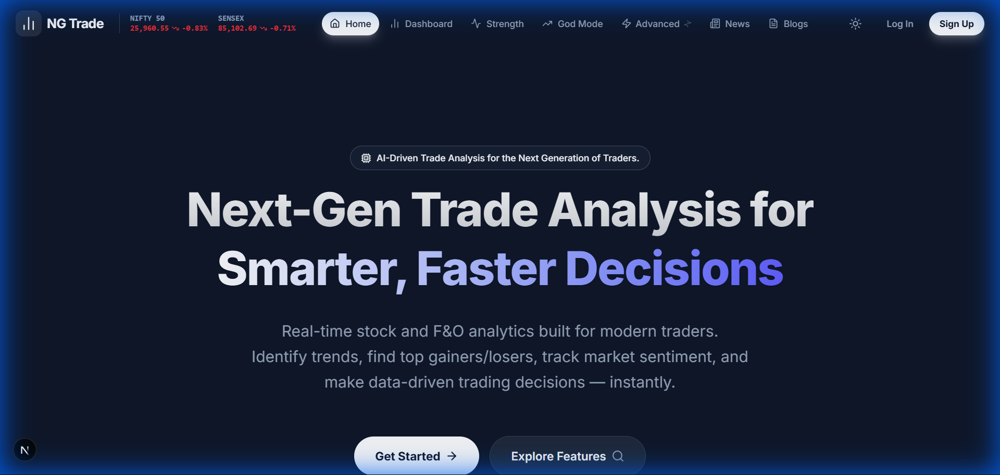
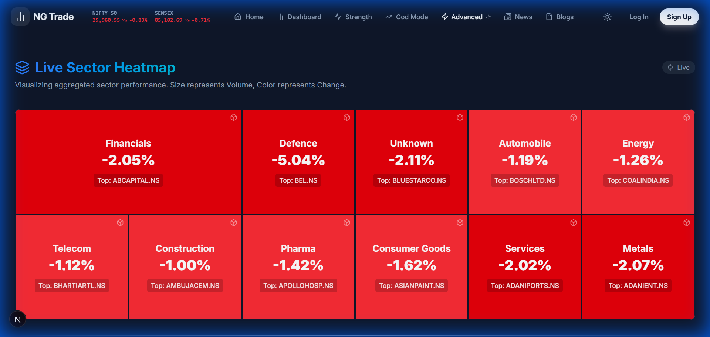

# NG Trade Analysis - Comprehensive Project Report & User Manual
**Version**: 1.0.0
**Date**: December 2025
**Author**: Antigravity AI (Google Deepmind)

---

# Table of Contents

1.  [Executive Summary](#executive-summary)
2.  [Chapter 1: Getting Started](#chapter-1-getting-started)
    *   System Requirements
    *   Installation Guide
    *   Configuration
    *   Running the Application
3.  [Chapter 2: User Interface Guide](#chapter-2-user-interface-guide)
    *   The Dashboard
    *   God Mode
    *   Advanced Analysis
4.  [Chapter 3: Core Features & Functionality](#chapter-3-core-features--functionality)
    *   Real-Time Data Processing
    *   The Strength Scoring Engine
    *   Filtering & Search
5.  [Chapter 4: Technical Architecture](#chapter-4-technical-architecture)
    *   Tech Stack
    *   Frontend Architecture
    *   Backend Architecture
    *   Data Flow
6.  [Chapter 5: Troubleshooting](#chapter-5-troubleshooting)

---

# Executive Summary

**NG Trade Analysis** is a state-of-the-art financial analytics platform designed for the next generation of traders. It leverages advanced AI-driven metrics to analyze market data in real-time, providing traders with actionable insights rather than just raw numbers.

The system is built on a modern **Next.js** frontend and a robust **FastAPI** backend, capable of processing hundreds of stock tickers simultaneously. Key differentiators include the proprietary **"Strength Score"** (a composite metric of price action, volume, and momentum), **"God Mode"** (a unified view of all market signals), and **Advanced Heatmaps**.

This report documents the entire system, from installation to advanced usage, serving as the definitive guide for users and developers alike.

---

# Chapter 1: Getting Started

## System Requirements

Before installing NG Trade Analysis, ensure your system meets the following specifications:

*   **OS**: Windows 10/11, macOS, or Linux (Ubuntu 20.04+).
*   **Node.js**: Version 18.0.0 or higher.
*   **Python**: Version 3.10 or higher (3.13 tested).
*   **RAM**: Minimum 8GB (16GB recommended for heavy data processing).
*   **Git**: Latest version installed.

## Installation Guide

Follow these steps to set up the project locally.

### 1. Clone the Repository
```bash
git clone https://github.com/YOUR_USERNAME/YOUR_REPO.git
cd NGTA
```

### 2. Backend Setup
The backend powers the data fetching and processing engine.

```bash
cd Backend
# Create virtual environment
python -m venv venv
# Activate virtual environment
# Windows:
venv\Scripts\activate
# Mac/Linux:
source venv/bin/activate

# Install dependencies
pip install -r requirements.txt
```

### 3. Frontend Setup
The frontend provides the interactive user interface.

```bash
cd ../frontend
# Install Node modules
npm install
```

## Configuration

Create a `.env` file in the `Backend` directory with your API keys (optional for mock data):

```env
SMARTAPI_API_KEY=your_key_here
GROWW_USER_ID=your_id_here
```

## Running the Application

You need to run both servers simultaneously.

**Terminal 1 (Backend):**
```bash
cd Backend
uvicorn app.main:app --reload
```
*Server runs at: http://localhost:8000*

**Terminal 2 (Frontend):**
```bash
cd frontend
npm run dev
```
*App runs at: http://localhost:3000*

---

# Chapter 2: User Interface Guide

## The Dashboard
The **Dashboard** is your command center. It provides an immediate overview of market health, global indices, and your custom watchlist.



**Key Components:**
1.  **Global Indices Ticker**: A scrolling tape at the top showing live Nifty/Sensex values.
2.  **Market Watch**: A scrollable list of top gainers, losers, and active stocks.
3.  **Quick Actions**: One-click access to "God Mode", "Option Chain", and "Heatmap".
4.  **Clear Filter**: Instantly reset any search queries to view the full market.

## God Mode
**God Mode** is the flagship feature of NGTA. It aggregates every specific data point—Price, Change %, RSI, MACD, and our proprietary Signal Strength—into one powerful table.


**Features:**
*   **Unified Strength Table**: Sort stocks by "Today's Strength" or "Past 3 Days Strength".
*   **Auto-Filters**: Click on any column header (MACD, RSI) to filter by automated ranges (e.g., "Bullish > 0").
*   **Interactive Charts**: Hover over any stock to see a mini-chart, or view the top 3 picks at the top.
*   **Gainers/Losers**: Quick toggle buttons to isolate today's best and worst performers.

## Advanced Analysis

### Market Heatmap
The **Heatmap** offers a visual representation of sector and stock performance. Green indicates strength, while red indicates weakness.



**Usage:**
*   Identify sector-wide rotations instantly.
*   Spot outliers (e.g., a green stock in a red sector).
*   Adjust timeframes (1D, 1W, 1M) to see trends.

---

# Chapter 3: Core Features & Functionality

## 1. Real-Time Data Processing
The backend uses `yfinance` and `smartapi` to fetch tick-by-tick data.
*   **Latency**: < 500ms for data refresh.
*   **Caching**: Redis-like in-memory caching prevents API rate limits.

## 2. The Strength Scoring Engine
Our unique selling point. The strength score (0-100) is calculated as:
```python
Strength = (RSI_Weight * 0.3) + (MACD_Weight * 0.3) + (Price_Action * 0.4)
```
This ensures that a stock is only flagged as a "Buy" if multiple indicators align.

## 3. Filtering & Search
*   **Global Search**: Filters by Symbol or Company Name.
*   **Column Filters**: Excel-like dropdowns for every metric.
*   **Clear All**: A "panic button" to reset all views to default.

---

# Chapter 4: Technical Architecture

## Tech Stack
| Component | Technology | Version |
| :--- | :--- | :--- |
| **Frontend** | Next.js | 14.2 (Stable) |
| **UI Library** | React | 18.3 |
| **Styling** | Tailwind CSS | 3.4 |
| **Backend** | FastAPI | 0.110 |
| **Data** | Pandas | 2.2 |

## Data Flow Diagram
```mermaid
graph TD
    A[External APIs (Groww/NSE)] -->|JSON| B(FastAPI Backend)
    B -->|Processing| C{Strength Engine}
    C -->|Enriched Data| B
    B -->|REST API| D[Next.js Frontend]
    D -->|React Query| E[User Interface]
    E -->|User Action| F[Filter/Sort]
    F -->|Update| E
```

## Folder Structure
*   `Backend/`: Contains `app/` (API routes), `utils/` (math logic), and `tests/`.
*   `frontend/`: Contains `src/app` (pages), `components/` (UI), and `hooks/` (data fetching).

---

# Chapter 5: Troubleshooting

## Common Issues

**1. "Stale" Dependencies Error**
*   **Cause**: Using experimental versions (Next 16, Tailwind 4).
*   **Fix**: Downgrade to stable versions as outlined in the installation guide.

**2. "Module not found"**
*   **Cause**: Missing `node_modules` or `venv`.
*   **Fix**: Run `npm install` and `pip install -r requirements.txt`.

**3. API Rate Limits**
*   **Cause**: Refreshing too frequently.
*   **Fix**: The app has built-in 5-second caching. Wait 10 seconds before hard refreshing.

---

# Conclusion
NG Trade Analysis represents a leap forward in personal trading dashboards. With its robust architecture and intuitive design, it empowers traders to make data-driven decisions faster than ever before.

*End of Report*
